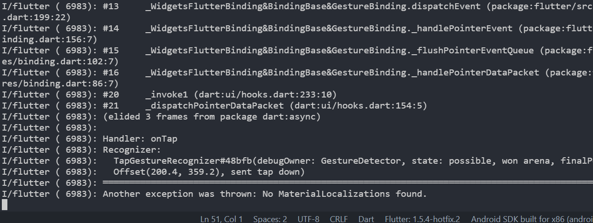
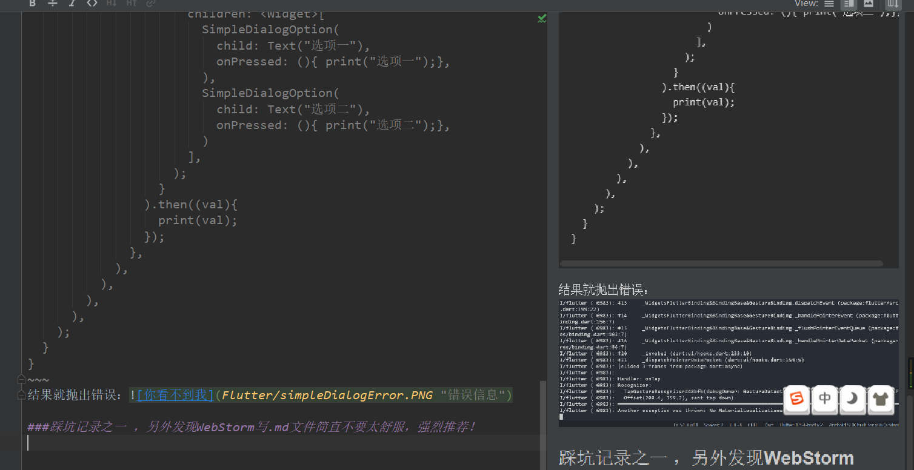

看了好久的官网，对于官方文档给的这个demo，始终不太明白，今天将报错百度了一下，终于解惑了。直接上demo
~~~
    import 'package:flutter/material.dart';
    
    void main() =>runApp(MyApp());
    
    class MyApp extends StatelessWidget{
      @override 
      Widget build(BuildContext context){
        return MaterialApp(
          home: Dlog()
        );
      }
    }
    
    class Dlog extends StatefulWidget {
      @override
      _DlogState createState() => _DlogState();
    }
    
    class _DlogState extends State<Dlog> {
      @override
      Widget build(BuildContext context) {
        return MaterialApp(
          home: Scaffold(
            body: Center(
              child: Container(
                child: MaterialButton(
                  child: Text("点我一下"),
                  onPressed: (){
                    showDialog(
                      context: context,
                      builder: (BuildContext context){
                        return SimpleDialog(
                          title: Text("我是title"),
                          children: <Widget>[
                            SimpleDialogOption(
                              child: Text("选项一"),
                              onPressed: (){ print("选项一");},
                            ),
                            SimpleDialogOption(
                              child: Text("选项二"),
                              onPressed: (){ print("选项二");},
                            )
                          ],
                        );
                      }
                    ).then((val){
                      print(val);
                    });
                  },
                ),
              ),
            ),
          ),
        );
      }
    }
~~~
一直过不去的坑是自己直接写了一个StatefluWidget去实现弹窗，点击按钮没有任何效果并且控制台报错 Another exception was thrown: No MaterialLocalizations found.
正确的写法应该是在外层套一个StatelessWidget的控件，这样才能正确实现flutter的弹窗。
<!-- more -->

####错误示范：
~~~
import 'package:flutter/material.dart';

void main() =>runApp(MyApp());

class MyApp extends StatefulWidget {
  @override
  _MyAppState createState() => _MyAppState();
}
class _MyAppState extends State<MyApp> {
  @override
  Widget build(BuildContext context) {
    return MaterialApp(
      home: Scaffold(
        body: Center(
          child: Container(
            child: MaterialButton(
              child: Text("点我一下"),
              onPressed: (){
                showDialog(
                  context: context,
                  builder: (BuildContext context){
                    return SimpleDialog(
                      title: Text("我是title"),
                      children: <Widget>[
                        SimpleDialogOption(
                          child: Text("选项一"),
                          onPressed: (){ print("选项一");},
                        ),
                        SimpleDialogOption(
                          child: Text("选项二"),
                          onPressed: (){ print("选项二");},
                        )
                      ],
                    );
                  }
                ).then((val){
                  print(val);
                });
              },
            ),
          ),
        ),
      ),
    );
  }
}
~~~
结果就抛出错误：

#####踩坑记录之一 ，另外发现WebStorm写.md文件简直不要太舒服，强烈推荐！

