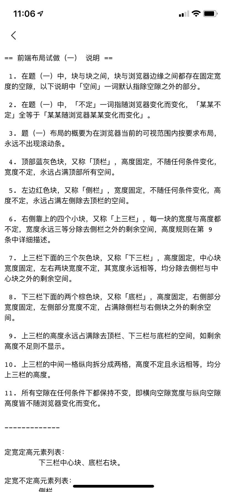
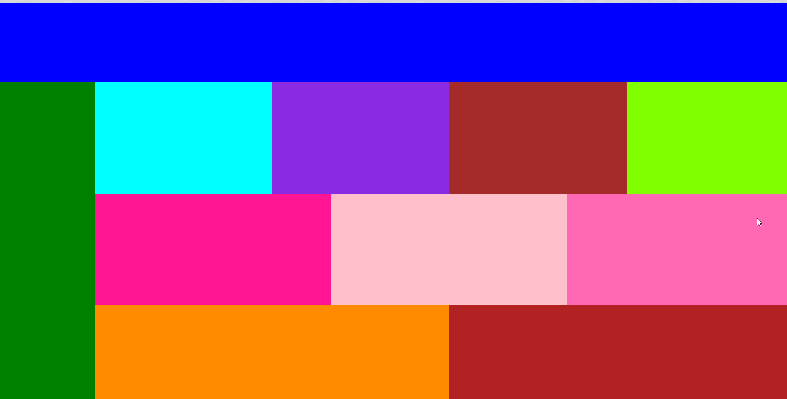

# 
基础为重！！！关于vw和vm的响应式应用

面试题，分享一波，主要是关于对响应式的css属性**vh-vw**的考察，以及对布局的整体考察。

~~~
<!DOCTYPE html>
<html lang="en">
<head>
    <meta charset="UTF-8">
    <title>demo</title>
  
</head>
<body>

  

  

    

    

      

        

        

        

        

      

      

        

        

        

      

      

        

        

      

    

  

</body>
</html>

~~~ 
###效果：

