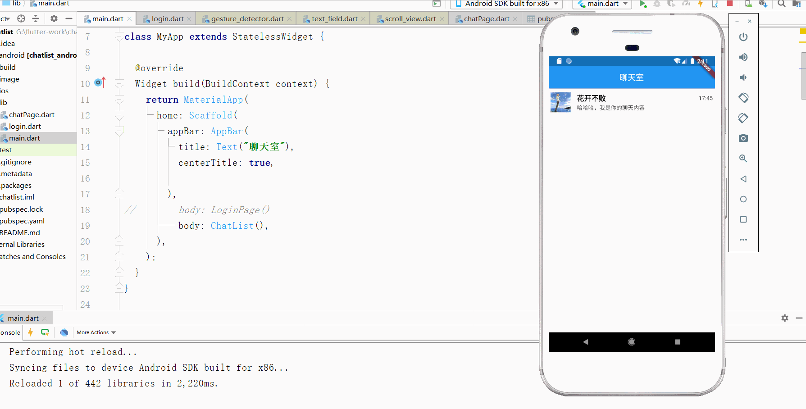
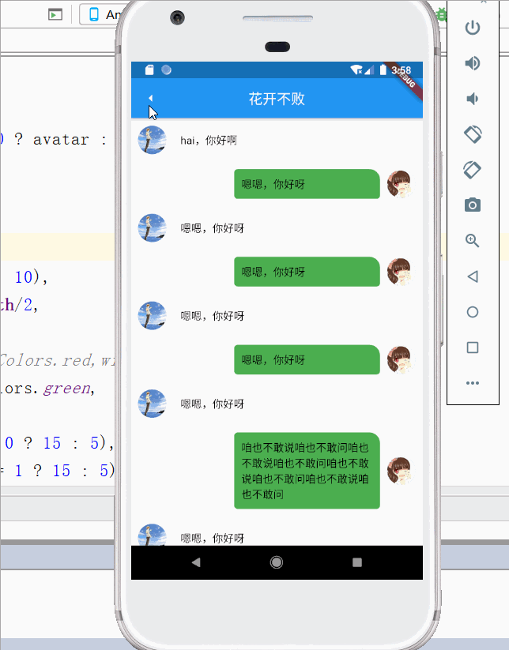
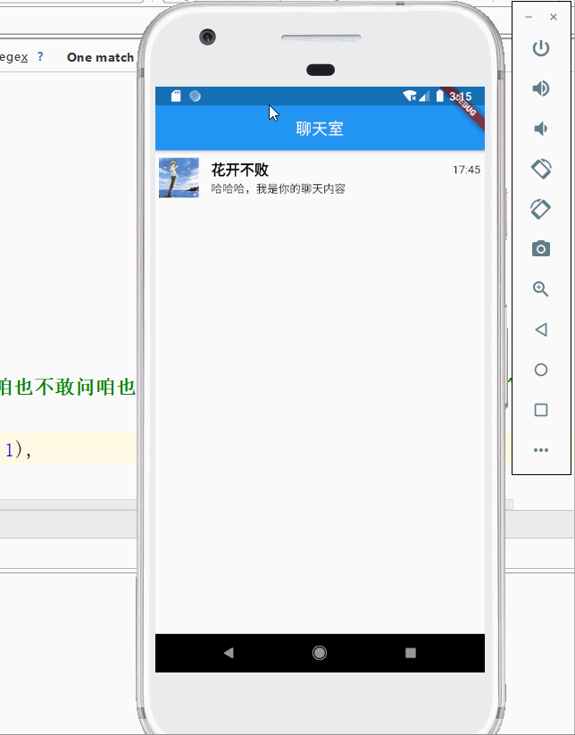

最近一直在学习`flutter`，所以还是有必要去做一些相关笔记的，`flutter`的生态有待完善，尤其是集成第三方SDK，目前大多数第三方包都是没有给flutter提供直接import集成方法的，但是好在flutter可以使用MethodChannel等方法来与底层进行通信，有助于我们更好的去集成，但是在此之前，你需要对flutter的dart和安卓的java以及Ios的Oc有一定的基础有一定的了解，不然就只能像我这样，黑夜中抓瞎。不多说了，写个聊天的小demo，目前只是实现基础的布局，可以先看预览的一下效果。

<!-- more -->
**第一步 首先实现基础的列表以及路由的跳转**

关于布局，其实没什么可以说的了，这是最基本的布局。因为表单这一块还没有思路，并没有展示出来。
整个小demo是分了两个`.dart`文件的。
`main.dart`入口函数
~~~
import 'package:flutter/material.dart';
import 'chatPage.dart';

void main()=> runApp(MyApp());

class MyApp extends StatelessWidget {

  @override
  Widget build(BuildContext context) {
    return MaterialApp(
      home: Scaffold(
        appBar: AppBar(
          title: Text("聊天室"),
          centerTitle: true,

        ),
        body: ChatList()
      ),
    );
  }
}

class ChatList extends StatefulWidget {
  @override
  _ChatListState createState() => _ChatListState();
}

class _ChatListState extends State<ChatList> {
  final title = "花开不败";

  @override
  Widget build(BuildContext context) {
    return ListView.builder(
          itemCount: messageData.length,
          itemBuilder: (BuildContext context , int index){
            return InkWell(
              child: MessageItem(messageData[index]),
              onTap: (){
                print(index);
                Navigator.push(context, MaterialPageRoute(builder: (context) => ChatPage(title)));
              },
            );
          },
        );
  }
}
//构造函数，这个函数应该具有：avatar ,nickName , title , chatContent, time 几个属性
 class MessageData{
   String avatar;
   String title;
   String chatContent;
   String time;
   MessageData(this.avatar,this.title,this.chatContent,this.time);
 }
// 将上述函数存放入数组，
List<MessageData> messageData = [
  MessageData("image/avatar.ico", "花开不败", "哈哈哈，我是你的聊天内容", "17:45")
];
// 聊天的布局
class MessageItem extends StatelessWidget {
 
  final MessageData message ;
// MessageItem调用MessageData的内部属性，用来填充布局上的一些变量
  MessageItem(this.message);
  final titleStyle = TextStyle(color: Colors.black,fontWeight: FontWeight.bold,fontSize: 18.0);
  @override
  Widget build(BuildContext context) {
    return  Container(
      margin: const EdgeInsets.all(5),
      decoration: BoxDecoration(
        // border: Border.all(color: Colors.black,width: 2)
      ),
      child: Row(
        children: <Widget>[
          Image.asset(message.avatar,width: 50,height: 50,),
          Container(
            margin: const EdgeInsets.fromLTRB(15, 5, 5, 5),
            child: Column(
              crossAxisAlignment: CrossAxisAlignment.start,
              children: <Widget>[
                Text(message.title,style: titleStyle,),
                Text(message.chatContent),
              ],
            ),
          ),
          Expanded(
            child: Container(
              margin: const EdgeInsets.fromLTRB(0, 0, 0, 20),
              decoration: BoxDecoration(
                // border: Border.all(color: Colors.red,width: 2.0)
              ),
              alignment: Alignment.topRight,
              child: Text(message.time),
            ),
          )
        ],
      ),
    );
  }
}
~~~

需要注意的是，关于列表这一块，不要盲目的去写，首先你应该知道，列表的数据一般都是服务端以一个对象的形式提供，对象内每一个数组都对应着每一个列表项，
`flutter`也为我们提供了一个`ListView.builder`的构造方法，让我们去遍历每一个数组的数据，然后生成列表。当你在开发相关项目时，你会明显的看到控制台打印相关的数据信息，前提是你在
初始化了一些第三方即时通讯的SDK并拿到相关列表数据。
在这里记一下关于 flutter 中**路由传参**吧.
---
在flutter中，通常使用`Navigator.push(context, MaterialPageRoute(builder: (context) => newPage( 要传递的参数 )));`来进行参数的传递,
例如本篇demo中，假设我们需要将用户的title传到聊天页面中，我们可以使用
~~~
Navigator.push(
    context, 
    MaterialPageRoute(
        builder: (context) => newPage( title //传递的title )
    )
)

//如果你只在这个页面写上title他下面是会出现红线报错的，因为在你要跳转的另一个页面内并没有发现title这个变量，就是没有去接受这个参数，
所以我们应该去第二个页面内 写一个构造函数用来接受这个参数
class ChatPage extends StatefulWidget {
//在这里接受路由传过来的参数
  final String title;
  ChatPage(this.title);
  @override
  _ChatPageState createState() => _ChatPageState();
}

class _ChatPageState extends State<ChatPage> {
  @override
  `````
另外当你需要使用的时候 ，你需要 用 widget.变量名 才能正确拿到值，如果传的参数是多个，同理，穿的时候参数用逗号分隔，接受的时候添加大括号，
一定要注意变量名需要正确匹配！
~~~

**第二步，实现连天页面的布局以及聊天记录**
然后到了关于聊天消息的页面，这边假设了一下聊天消息，和user识别，以及对应user的头像。先看一下效果图吧。

~~~
import 'package:flutter/material.dart';

class ChatPage extends StatefulWidget {
  final String title;
  ChatPage(this.title);
  @override
  _ChatPageState createState() => _ChatPageState();
}

class _ChatPageState extends State<ChatPage> {
  @override
  Widget build(BuildContext context) {
    return Scaffold(
      appBar: AppBar(
        title: Text(widget.title),
        centerTitle: true,
        leading: IconButton(
          icon: Icon(Icons.arrow_left),
          onPressed: (){
            Navigator.pop(context);
          },
        ),
      ),
      body: ListView(
        children: <Widget>[
          ListView(
            shrinkWrap: true,
            physics: new NeverScrollableScrollPhysics(),
            children: <Widget>[
              chatMessageItem("image/avatar.ico","hai，你好啊",0),
              chatMessageItem("image/demo2.jpg","嗯嗯，你好呀",1),
              chatMessageItem("image/avatar.ico","嗯嗯，你好呀",0),
              chatMessageItem("image/demo2.jpg","嗯嗯，你好呀",1),
              chatMessageItem("image/avatar.ico","嗯嗯，你好呀",0),
              chatMessageItem("image/demo2.jpg","嗯嗯，你好呀",1),
              chatMessageItem("image/avatar.ico","嗯嗯，你好呀",0),
              chatMessageItem("image/demo2.jpg","咱也不敢说咱也不敢问咱也不敢说咱也不敢问咱也不敢说咱也不敢问咱也不敢说咱也不敢问",1),
              chatMessageItem("image/avatar.ico","嗯嗯，你好呀",0),
              chatMessageItem("image/demo2.jpg","哈哈哈 恭喜你也看到了我得消息",1),
                //这些都是伪数据 ，当你真实调用的时候，每条消息都会包含许多信息，conversation:{...}
            ],
          )
        ],
      ),
    );
  }

  Widget chatMessageItem(String avatar , String message , int user){
    return Container(
      margin: EdgeInsets.symmetric(horizontal: 10,vertical:10),
      child:Row(
        mainAxisAlignment: user == 0 ? MainAxisAlignment.start: MainAxisAlignment.end,
        children: <Widget>[
          Container(
              child:user == 0 ?  CircleAvatar(
                backgroundImage: AssetImage(user == 0 ? avatar : ""),
              ):null

          ),
          Container(
              margin: EdgeInsets.only(left: 10,right: 10),
              width: MediaQuery.of(context).size.width/2,
              decoration: BoxDecoration(
                color: Colors.yellow,
                borderRadius: BorderRadius.only(
                    topLeft: Radius.circular(user == 0 ? 15 : 5),
                    topRight: Radius.circular(user == 1 ? 15 : 5),
                    bottomLeft: Radius.circular(5),
                    bottomRight: Radius.circular(5)
                ),
              ),
              child: Padding(
                child: Text(message,style: TextStyle(color: Colors.black,fontSize: 15),softWrap: true,maxLines: 50,),
                padding: EdgeInsets.symmetric(horizontal: 10,vertical: 10),
              )
          ),
          Container(
            child:user == 1 ?  CircleAvatar(
              backgroundImage: AssetImage(user == 1 ? avatar : ""),
            ):null
          )
        ],
      ),
    );
  }
}
~~~

在这里 ，我们整体的布局建议采用 外层Column嵌套ListView的布局来实现 ，内部ListView用于实现聊天记录的滚动，外层用来保证下面将要写的表单不被键盘弹出框遮住。如果你使用ListView嵌套listview的话 可能会有一些布局显示不出来的小问题 ，解决方案是在外层Listview内添加如下内容
~~~
shrinkWrap: true, //内容适配
physics: new NeverScrollableScrollPhysics(),// 禁止滚动
~~~
我们将每一个对话定义为conversation，这个conversation里面包含消息发送者的资料，以及消息文本 ，将这些数据放在一个数组内，由ListView.builder构造函数将每一条渲染出来，

聊天页面最重要的便是提供用户输入内容的表单了。

---
**第三步  完善表单**
继续更 ，现在完成了表单的输入以及消息内容的发送，老规矩 ，先上图：


**整理了一下代码的结构**

chatPage:
~~~
import 'package:flutter/material.dart';
import 'dart:io';
import 'dart:ui';
class ChatPage extends StatefulWidget {
  final String title;
  ChatPage(this.title);
  @override
  _ChatPageState createState() => _ChatPageState();
}

class _ChatPageState extends State<ChatPage> {
  TextEditingController _message = new TextEditingController();
  FocusNode focusNode = new FocusNode();
  bool isSend = false ;
  @override
  Widget build(BuildContext context) {
    return Scaffold(
      appBar: AppBar(
        title: Text(widget.title),
        centerTitle: true,
        leading: IconButton(
          icon: Icon(Icons.arrow_left),
          onPressed: (){
            Navigator.pop(context);
          },
        ),
      ),
      body: new Column(
        children: <Widget>[
          Container(
            child:new Flexible(
              child:  InkWell(
                child: ListView.builder(
                  itemCount: conversations.length,
                  itemBuilder: (BuildContext , int index ){
                    return ConversationItem(conversations[index]);
                  },
                ),
                onTap: (){
// 点击聊天记录空白处，将表单的焦点，即让弹出的键盘框收回去。
                  focusNode.unfocus();
                },
              )
            )
          ),
          Container(
            padding: const EdgeInsets.symmetric(vertical: 5),
            child: Row(
              children: <Widget>[
                Container(
                  margin:const EdgeInsets.symmetric(horizontal: 10),
                  child: Image.asset("image/voice.png",width: 30,height: 30,),
                ),
                Expanded(
                  child: Container(
                    child: TextField(
                      autofocus: true,
                      focusNode: focusNode,
                      style: TextStyle(fontSize: 18,color: Colors.black),
                      controller: _message,
                      decoration: InputDecoration(
                        border: OutlineInputBorder(),
                        contentPadding: EdgeInsets.symmetric(horizontal: 10,vertical: 10),
                        fillColor: Colors.white
                      ),
                      onChanged: (val){
//                        print(_message.text);
                        if(_message.text == ""){
                          setState(() {
                            isSend = false ;
                          });
                        }else if(_message.text != null ){
                          setState(() {
                            isSend = true ;
                          });
                        }
                      },
                    ),
                  ),
                ),
              Container(
                  margin:const EdgeInsets.symmetric(horizontal: 10),
                  child: isSend == false ? Image.asset("image/add.png",width: 30,height: 30,) : InkWell(
                    child: Image.asset("image/send.png",width: 30,height: 30,),
                    onTap: (){

// 点击发送时，我们将存放conversation的数组新增一条消息记录，默认头像是自己的头像 ，用户点击发送后，将表单内的文本内容添加到conversation里面，
并初始化表单为 “” 。
                      setState(() {
                        conversations.add(Conversation("image/demo2.jpg", _message.text, 1));
                      });
                      _message.clear();
                      _message.text == "";
                    },
                  ),
              )
              ],
            ),
          )
        ],
      ),
    );
  }
}

class Conversation {
  String avatar ;
  String text ;
  int user ;
  Conversation(this.avatar,this.text,this.user,);
}
List<Conversation> conversations =[
  Conversation("image/avatar.ico","hai，你好啊",0),
  Conversation("image/demo2.jpg","嗯嗯，你好呀",1),
  Conversation("image/avatar.ico","嗯嗯，你好呀",0),
  Conversation("image/demo2.jpg","嗯嗯，你好呀",1),
  Conversation("image/avatar.ico","嗯嗯，你好呀",0),
  Conversation("image/demo2.jpg","嗯嗯，你好呀",1),
  Conversation("image/avatar.ico","嗯嗯，你好呀",0),
  Conversation("image/demo2.jpg","咱也不敢说咱也不敢问咱也不敢说咱也不敢问咱也不敢说咱也不敢问咱也不敢说咱也不敢问",1),
  Conversation("image/avatar.ico","嗯嗯，你好呀",0),
  Conversation("image/demo2.jpg","哈哈哈 恭喜你也看到了我得消息",1),
];

class ConversationItem extends StatelessWidget {
  final Conversation conversation ;
  ConversationItem(this.conversation);
  @override
  Widget build(BuildContext context) {
    return Container(
      margin: EdgeInsets.symmetric(horizontal: 10,vertical:10),
      child:Row(
        mainAxisAlignment: conversation.user == 0 ? MainAxisAlignment.start: MainAxisAlignment.end,
        children: <Widget>[
          Container(
              child:conversation.user == 0 ?  CircleAvatar(
                backgroundImage: AssetImage(conversation.user == 0 ? conversation.avatar : ""),
              ):null

          ),
          Container(
              margin: EdgeInsets.only(left: 10,right: 10),
              width: MediaQuery.of(context).size.width/2,
              decoration: BoxDecoration(
//                        border: Border.all(color: Colors.red,width: 1),
                color: conversation.user == 0 ? Colors.white : Colors.green,
                borderRadius: BorderRadius.only(
                    topLeft: Radius.circular(conversation.user == 0 ? 15 : 5),
                    topRight: Radius.circular(conversation.user == 1 ? 15 : 5),
                    bottomLeft: Radius.circular(5),
                    bottomRight: Radius.circular(5)
                ),
              ),
              child: Padding(
                child: Text(conversation.text,style: TextStyle(color: Colors.black,fontSize: 15),softWrap: true,maxLines: 50,),
                padding: EdgeInsets.symmetric(horizontal: 10,vertical: 10),
              )
          ),
          Container(
              child:conversation.user == 1 ?  CircleAvatar(
                backgroundImage: AssetImage(conversation.user == 1 ? conversation.avatar : ""),
              ):null
          )
        ],
      ),
    );
  }
}

~~~
### 继续更新一下代码存在的问题：
- 修改输入框使用的固定宽度，改用 `constraints` 来为聊天消息的容器设置最大宽度，如果小于最大宽度，默认容器大小由子元素撑开，大于最大宽度，
默认换行。
在聊天消息的布局处添加contraints属性，设置maxWidth
~~~
...
constraints: BoxConstraints(
                maxWidth: MediaQuery.of(context).size.width/2,
              ),
...
~~~

- 完善输入框输入完内容后 “+” 图标无法替换发送的图标，在发送消息事件最后把`isSend`设置为false
~~~
onTap: (){
  setState(() {
    conversations.add(Conversation("image/demo2.jpg", _message.text, 1));
  });
  _message.clear();
//修改isSend的值
  isSend = false ;
},
~~~
##### 再来看一下效果

