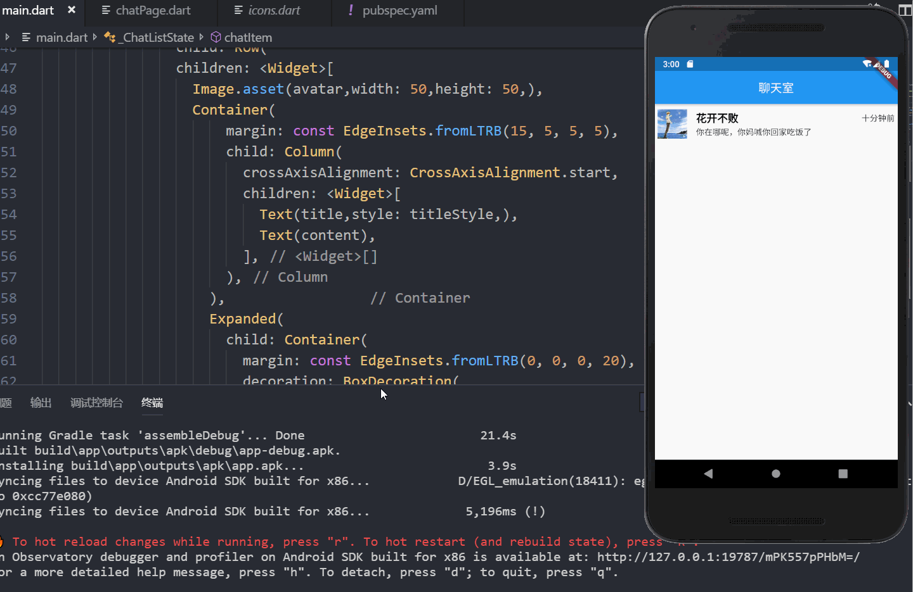
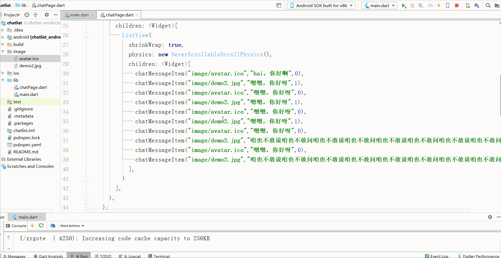

今天复习了一下Flutter的布局，写了一个聊天的小demo。关于布局这一方面，没有什么可以记录的坑，所以直接贴代码看效果图吧

main.dart:
~~~
   import 'package:flutter/material.dart';
   import 'chatPage.dart';
   
   void main()=> runApp(MyApp());
   
   class MyApp extends StatelessWidget {
   
     @override
     Widget build(BuildContext context) {
       return MaterialApp(
         home: Scaffold(
           appBar: AppBar(
             title: Text("聊天室"),
             centerTitle: true,
   
           ),
           body: ChatList()
         ),
       );
     }
   }
   
   class ChatList extends StatefulWidget {
     @override
     _ChatListState createState() => _ChatListState();
   }
   
   class _ChatListState extends State<ChatList> {
     final title = "花开不败";
     final titleStyle = TextStyle(color: Colors.black,fontWeight: FontWeight.bold,fontSize: 18.0);
     @override
     Widget build(BuildContext context) {
       return ListView(
             children: <Widget>[
               chatItem("image/avatar.ico", title, "你在哪呢，你妈喊你回家吃饭了", "十分钟前")
             ],
           );
     }
     Widget chatItem(String avatar , String title,String content,String time){
       return GestureDetector(
                 child: Container(
                   margin: const EdgeInsets.all(5),
                   decoration: BoxDecoration(
                     // border: Border.all(color: Colors.black,width: 2)
                   ),
                   child: Row(
                   children: <Widget>[
                     Image.asset(avatar,width: 50,height: 50,),
                     Container(
                         margin: const EdgeInsets.fromLTRB(15, 5, 5, 5),
                         child: Column(
                           crossAxisAlignment: CrossAxisAlignment.start,
                           children: <Widget>[
                             Text(title,style: titleStyle,),
                             Text(content),
                           ],
                         ),
                       ),                
                       Expanded(
                         child: Container(
                           margin: const EdgeInsets.fromLTRB(0, 0, 0, 20),
                           decoration: BoxDecoration(
                             // border: Border.all(color: Colors.red,width: 2.0)
                           ),
                           alignment: Alignment.topRight,
                           child: Text(time),
                         ),
                       )
                     ],
                   ),
                 ),
                 onTap: (){
                   Navigator.push(
                     context, MaterialPageRoute(
                       builder: (BuildContext context){
                         return ChatPage(title);
                       }
                     )
                   );
                 },
               );
     }
   }
   
   
~~~

<!-- more -->
chatPage.dart:
~~~
    import 'package:flutter/material.dart';
    
    class ChatPage extends StatefulWidget {
      final String title;
      ChatPage(this.title);
      @override
      _ChatPageState createState() => _ChatPageState();
    }
    
    class _ChatPageState extends State<ChatPage> {
      @override
      Widget build(BuildContext context) {
        return Scaffold(
          appBar: AppBar(
            title: Text("花开不败"),
            centerTitle: true,
            leading: IconButton(
              icon: Icon(Icons.arrow_left),
              onPressed: (){
                Navigator.pop(context);
              },
            ),
          ),
          body: ListView(
            children: <Widget>[
              Text("大家好")
            ],
          ),
        );
      }
    }
~~~

其实仔细看的话 ，这个聊天列表的页面写的乱糟糟的一团，然后咱们优化一下这些繁琐的代码：
~~~
 class MessageData{
   String avatar;
   String title;
   String chatContent;
   String time;
   MessageData(this.avatar,this.title,this.chatContent,this.time);
 }
~~~
定义MessageData这个类，这个类调用自身的变量
~~~
List<MessageData> messageData = [
  MessageData("image/avatar.ico", "花开不败", "哈哈哈，我是你的聊天内容", "17:45")
];
~~~
定义一个数组，用来存放构建列表项的数据，每一条即是一个列表项。一方面增加页面代码的可读性，另一方面，后期调用后台数据的时候，可以直接赋值直接生成列表。
~~~
class MessageItem extends StatelessWidget {
  final MessageData message ;
  MessageItem(this.message);
  final titleStyle = TextStyle(color: Colors.black,fontWeight: FontWeight.bold,fontSize: 18.0);
  @override
  Widget build(BuildContext context) {
    return  Container(
      margin: const EdgeInsets.all(5),
      decoration: BoxDecoration(
        // border: Border.all(color: Colors.black,width: 2)
      ),
      child: Row(
        children: <Widget>[
          Image.asset(message.avatar,width: 50,height: 50,),
          Container(
            margin: const EdgeInsets.fromLTRB(15, 5, 5, 5),
            child: Column(
              crossAxisAlignment: CrossAxisAlignment.start,
              children: <Widget>[
                Text(message.title,style: titleStyle,),
                Text(message.chatContent),
              ],
            ),
          ),
          Expanded(
            child: Container(
              margin: const EdgeInsets.fromLTRB(0, 0, 0, 20),
              decoration: BoxDecoration(
                // border: Border.all(color: Colors.red,width: 2.0)
              ),
              alignment: Alignment.topRight,
              child: Text(message.time),
            ),
          )
        ],
      ),
    );
  }
}
~~~

这个为每一个列表项的布局，因为布局都是一样的，所以咱们可以直接封装一下，传入必须的一些参数就可以了，例如 用户的头像，昵称 ，聊天内容等

~~~
Widget build(BuildContext context) {
    return ListView.builder(
          itemCount: messageData.length,
          itemBuilder: (BuildContext context , int index){
            return InkWell(
              child: MessageItem(messageData[index]),
              onTap: (){
                print(index);
                Navigator.push(context, MaterialPageRoute(builder: (context) => ChatPage()));
              },
            );
          },
        );
  }
~~~
最后咱们使用flutter中ListView.builder方法来进行列表项的构造。这样使得代码更加简洁明了。

然后继续看一下聊天记录的页面，在这里直接看图吧。明天再更，太晚了。

上一下布局的代码 关于布局 没什么难的 ，难的是下一步的表单和腾讯IM即时通讯的三方SDK集成
chatPage.dart :
~~~
import 'package:flutter/material.dart';

class ChatPage extends StatefulWidget {
//  final String title;
//  ChatPage(this.title);
  @override
  _ChatPageState createState() => _ChatPageState();
}

class _ChatPageState extends State<ChatPage> {
  @override
  Widget build(BuildContext context) {
    return Scaffold(
      appBar: AppBar(
        title: Text("花开不败"),
        centerTitle: true,
        leading: IconButton(
          icon: Icon(Icons.arrow_left),
          onPressed: (){
            Navigator.pop(context);
          },
        ),
      ),
      body: ListView(
        children: <Widget>[
          ListView(
            shrinkWrap: true,
            physics: new NeverScrollableScrollPhysics(),
            children: <Widget>[
              chatMessageItem("image/avatar.ico","hai，你好啊",0),
              chatMessageItem("image/demo2.jpg","嗯嗯，你好呀",1),
              chatMessageItem("image/avatar.ico","嗯嗯，你好呀",0),
              chatMessageItem("image/demo2.jpg","嗯嗯，你好呀",1),
              chatMessageItem("image/avatar.ico","嗯嗯，你好呀",0),
              chatMessageItem("image/demo2.jpg","嗯嗯，你好呀",1),
              chatMessageItem("image/avatar.ico","嗯嗯，你好呀",0),
              chatMessageItem("image/demo2.jpg","咱也不敢说咱也不敢问咱也不敢说咱也不敢问咱也不敢说咱也不敢问咱也不敢说咱也不敢问",1),
              chatMessageItem("image/avatar.ico","嗯嗯，你好呀",0),
              chatMessageItem("image/demo2.jpg","咱也不敢说咱也不敢问咱也不敢说咱也不敢问咱也不敢说咱也不敢问咱也不敢说咱也不敢问",1),
            ],
          )
        ],
      ),
    );
  }

  Widget chatMessageItem(String avatar , String message , int user){
    return Container(
      margin: EdgeInsets.symmetric(horizontal: 10,vertical:10),
      child:Row(
        mainAxisAlignment: user == 0 ? MainAxisAlignment.start: MainAxisAlignment.end,
        children: <Widget>[
          Container(
              child:user == 0 ?  CircleAvatar(
                backgroundImage: AssetImage(user == 0 ? avatar : ""),
              ):null

          ),
          Container(
              margin: EdgeInsets.only(left: 10,right: 10),
              width: MediaQuery.of(context).size.width/2,
              decoration: BoxDecoration(
//                        border: Border.all(color: Colors.red,width: 1),
                color: Colors.yellow,
                borderRadius: BorderRadius.only(
                    topLeft: Radius.circular(user == 0 ? 15 : 5),
                    topRight: Radius.circular(user == 1 ? 15 : 5),
                    bottomLeft: Radius.circular(5),
                    bottomRight: Radius.circular(5)
                ),
              ),
              child: Padding(
                child: Text(message,style: TextStyle(color: Colors.black,fontSize: 15),softWrap: true,maxLines: 50,),
                padding: EdgeInsets.symmetric(horizontal: 10,vertical: 10),
              )
          ),
          Container(
            child:user == 1 ?  CircleAvatar(
              backgroundImage: AssetImage(user == 1 ? avatar : ""),
            ):null
          )
        ],
      ),
    );
  }
}
~~~

