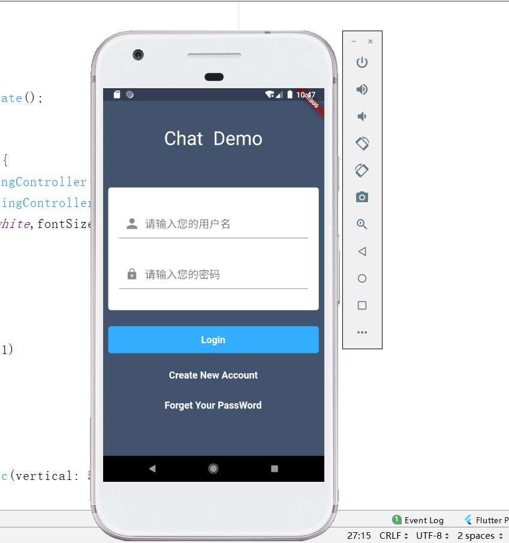

写完chatPage之后 ，突发奇想的继续写一个`Login`的页面，先实现基本的页面布局，表单验证等功能后续添加，宇宙第一规则：先上图

页面自己随便设计的，不喜勿喷
<!-- more -->
这种布局相对来说还是比较简单的，整体我这里采用的是一个ListView，里面添加表单按钮等组件就好了，
代码如下
~~~
import 'package:flutter/material.dart';

class LoginPage extends StatefulWidget {
  @override
  _LoginPageState createState() => _LoginPageState();
}

class _LoginPageState extends State<LoginPage> {
  TextEditingController account = new TextEditingController();
  TextEditingController password = new TextEditingController();
  final commonStyle = TextStyle(color: Colors.white,fontSize: 18,fontWeight: FontWeight.bold);
  @override
  Widget build(BuildContext context) {
    return Scaffold(
      body: Container(
        decoration: BoxDecoration(
            color: Color.fromRGBO(67, 83, 109, 1)
        ),
        child: ListView(
          children: <Widget>[
//            logo
            Container(
              margin: const EdgeInsets.symmetric(vertical: 50),
              child: Center(
                child: Text("Chat Demo",style: TextStyle(color: Colors.white,fontSize: 35,wordSpacing: 10),),
              ),
            ),
//            登录注册表单
            Container(
              height: MediaQuery.of(context).size.height/3,
              margin: const EdgeInsets.symmetric(horizontal: 10,vertical: 20),
              decoration: BoxDecoration(
                color: Colors.white,
                borderRadius: BorderRadius.circular(5)
              ),
              child: new Column(
                mainAxisAlignment: MainAxisAlignment.spaceEvenly,
                children: <Widget>[
//                  输入账号
                  Container(
                    padding:const EdgeInsets.symmetric(horizontal: 20),
                    child: new TextField(
                      controller: account,
                      style: TextStyle(fontSize: 20),
                      maxLines: 1,
                      autofocus: true,
//                      keyboardType:TextInputType.number,
                      decoration: InputDecoration(
                        prefixIcon: Icon(Icons.person,size: 30,),
                        hintText: "请输入您的用户名",
                      ),
                    ),
                  ),
//                  密码输入框
                  Container(
                    padding: const EdgeInsets.symmetric(horizontal: 20),
                    child: new TextField(
                      style: TextStyle(fontSize: 20),
                      controller: password,
                      obscureText: true,
                      decoration: InputDecoration(
                        prefixIcon: Icon(Icons.lock),
                        hintText: "请输入您的密码"
                      ),
                    ),
                  ),
                ],
              ),
            ),
//            登录按钮
            InkWell(
              child: Container(
                height: 50,
                alignment: Alignment.center,
                margin: const EdgeInsets.symmetric(horizontal: 10,vertical: 10),
                decoration: BoxDecoration(
                  color:Color.fromRGBO(51, 173, 255, 1),
                  borderRadius: BorderRadius.circular(5),
                ),
                child: Text("Login",style: commonStyle),
              ),
              onTap: (){
                print("login");
              },
            ),
//            注册
            Container(
              margin: const EdgeInsets.symmetric(horizontal: 10,vertical: 20),
              alignment: Alignment.center,
              child: InkWell(
                child: Text("Create New Account",style: commonStyle),
                onTap: (){
                  print("创建新的账号");
                },
              ),
            ),
//            忘记密码
            Container(
              margin: const EdgeInsets.symmetric(horizontal: 10,vertical: 15),
              alignment: Alignment.center,
              child: InkWell(
                child: Text("Forget Your PassWord",style: commonStyle),
                onTap: (){
                  print("创建新的账号");
                },
              ),
            ),
          ],
        ),
      ),
    );
  }
}
~~~

这里用到了`InkWell`这个控件，点进去看下他的构造函数：
~~~
  const InkWell({
    Key key,
    Widget child,
    GestureTapCallback onTap,
    GestureTapCallback onDoubleTap,
    GestureLongPressCallback onLongPress,
    GestureTapDownCallback onTapDown,
    GestureTapCancelCallback onTapCancel,
    ValueChanged<bool> onHighlightChanged,
    Color highlightColor,
    Color splashColor,
    InteractiveInkFeatureFactory splashFactory,
    double radius,
    BorderRadius borderRadius,
    ShapeBorder customBorder,
    bool enableFeedback = true,
    bool excludeFromSemantics = false,
  }) 
~~~
你可以很直观的看到 ，这个控件就是用来包裹一个本身不带有点击事件的元素，从而为这个元素绑定点击事件，所以当你需要为一个元素绑定点击事件时 ，可以优先考虑`InkWell`,
