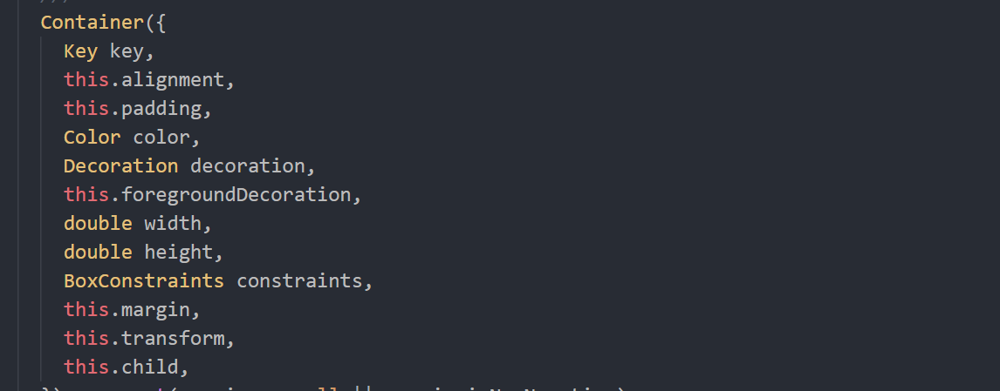

**Flutter常用组件**

* 容器组件
* 文本组件
* 图片组件
* 图标组件
    - 图标组件
    - 图标按钮组件
    - 凸起按钮组件
* 列表组件
    * 基础列表组件
    * 水平列表组件
    * 长列表组件
    * 网格列表组件
* 表单组件

---

**一、容器组件**

Container类似于HTML中的Div（盒子），里面用来容纳子元素，自身具备一些属性，用来调整
子元素的位置及自身样式。

首先，你应该要知道这些：
1. 如果不给Container设置宽高，但是这个容器有子元素，那么这个容器的大小是由子元素（child）的大小决定的：

2. 如果给Container设置高度，容器没有子元素，那么这个容器的宽度默认为当前设备屏幕的宽度，高度为赋值的高度，

3. 如果给Container设置高度，容器有子元素，那么这个容器的宽度默认为子元素的宽度，高度为赋值的高度

看一下他的的构造函数:

通一下Container的这些属性
~~~
    this.alignment,用来快速调整子元素的位置，9个方位(topLeft,topCenter,topRight)
    this.padding,众所周知,类似于盒模型的内边距
    Color color,Container的背景颜色
    Decoration decoration,一个很强大的属性，直译为装饰，通过此属性可设置容器的边框，阴影，渐变，圆角等样式效果
    this.foregroundDecoration,子元素的前景色
    double width,容器的高度
    double height,容器的宽度
    BoxConstraints constraints,盒约束，类似于 min-width,max-height 等
    this.margin,同padding
    this.transform,平移 缩放 旋转 ， 主要适用于动画
    this.child,
~~~
Tip:
* alignment的属性值除了可以写成诸如topLeft,也可以使用坐标表示Alignment(x,y)，以center为原点的坐标轴
,具体用法看源码。
* padding属性值的多种表示， 
    - EdgeInsets.all(value),设置四个方向一样的值
    - EdgeInsets.only(left:val1,top:left2,bottom:val3,right:val4),单独设置某个方向的值，这个可以同时设置四个方向的值，类似于EdgeInsets.fromLTRB
    - EdgeInsets.symmetric(horizontal: val1, vertical: val2),用于设置水平/垂直方向上的值，例如水平方向设置为10，那么子元素的左右内边距分别为10.
    - EdgeInsets.fromLTRB(left,top,right,bottom)按照左上右下的顺序分别设置内边距的值
* Color 关于flutter中color值的表示方法：
    - color:Colors.red / Colors.red[100] 对应的颜色英文单词
    - color:Color.fromRGBO rgb值,o代表透明度
    - color:Color.fromARGB a:Alpha(透明度通道)+RGB色彩模式, 例如：#1e000000，前面两位表示16进制的透明度
* Decoration Container容易常用的是boxDecoration，继承自Decoration类。
    - 边框：border 
    ~~~
       //设置四条黑色的宽度为3的边框
       BoxDecoration(
         border: Border.all(color: Colors.black, width: 3, style: BorderStyle.solid)
       )
       
       // 设置单边框：上边框为3px粗细的黑色实线边框，右边框为1px粗细的红色实线边框
       BoxDecoration(
         border: Border(
           top: BorderSide(color: Colors.black, width: 2, style: BorderStyle.solid),
           right: BorderSide(color: Colors.red, width: 2, style: BorderStyle.solid),
         ),
       )
    ~~~
    
    
    
    - 阴影 shadow，和css3中shadow的定义基本上一致，
    ~~~
    BoxDecoration(
      boxShadow: [
        BoxShadow(
          offset: Offset(0, 0),
          blurRadius: 6,
          spreadRadius: 10,
          color: Color.fromARGB(20, 0, 0, 0),
        ),
      ],
    )
    ~~~
    
    - 圆角 borderRadius
    ~~~
        // 同时设置4个角的圆角为5
        BoxDecoration(
          borderRadius: BorderRadius.circular(5),
        )
        
        // 设置单圆角：左上角的圆角为5，右上角的圆角为10
        BoxDecoration(
          borderRadius: BorderRadius.only(
            topLeft: Radius.circular(5),
            topRight: Radius.circular(10),
          ),
        )
    ~~~
    
    -渐变 gradient
    ~~~
        // 从左到右，黄色到蓝色的线性渐变
        BoxDecoration(
          gradient: LinearGradient(
            begin: Alignment.centerLeft,
            end: Alignment.centerRight,
            colors: [Colors.yellow, Colors.blue],
          ),
        )
        
        // 从中心向四周扩散，黄色到蓝色的径向渐变
        BoxDecoration(
          gradient: RadialGradient(
            center: Alignment.center,
            colors: [Colors.yellow, Colors.blue],
          ),
        )
    ~~~
    
    
    - 盒约束 Constraints
    ~~~
        // 容器的大小将被限制在[100*100 ~ 200*200]内
        BoxConstraints(
          minWidth: 100,
          maxWidth: 200,
          minHeight: 100,
          maxHeight: 200,
        )
    ~~~
    
---
**二、文本组件**

* Text

看一下他的构造函数(常用)

~~~
const Text(
  this.data, {  data 引号引起来用来显示文本信息
  Key key,
  this.style,文本的样式
  this.textAlign,文字的对齐方式
  this.softWrap,文字是否自动换行
  this.overflow,文字溢出所采取对应的操作
  this.maxLines,文字显示的最多行数
}) 
~~~
* Text文本比较容易理解，难点不多。源码有相关对应样式，一眼明了，不做多解释。

---

* Text.rich() 富文本

~~~
const Text.rich(
    this.textSpan, 包裹text的容器{
    Key key,
    this.style,
    this.strutStyle,
    this.textAlign,
    this.textDirection,
    this.locale,
    this.softWrap,
    this.overflow,
    this.textScaleFactor,
    this.maxLines,
    this.semanticsLabel,
  })
~~~

Demo:

~~~
Text.rich(
   TextSpan(children:[ TextSpan(text:'￥',style: TextStyle(color: Colors.red,fontSize: 50)),
        TextSpan(text:'人民币',style: TextStyle(color: Colors.blue,fontSize: 25)) 
     ])
    ),
~~~

---

**三、图片组件**
* 关于图片的引入,直接看图吧，简单明了。

在引入图片的时候有一个小技巧，在上图中，我的Image文件夹中存放两个image图片，但是有没有注意到我只是写了一句
~~~
    assets:
        - image/
~~~
这个方式表示将引入该文件下所有image的图片，所以你不必像之前一样精确到该文件夹下的每一个image。

* 关于加载图片资源的几种方式
    - `Image.asset` : 加载资源图片
    - `Image.file` : 加载本地图片文件
    - `Image.netWork` : 加载网络图片
    - `Image.memory` : 加载Uint8List资源图片    
    
* Image的常用属性:

|属性名| 类型|说明|
|:----:|:----:|:----:|      
|width/height| double|Image容器的宽高|
| fit|BoxFit|图片的填充模式|
| color|Color|图片颜色|
|colorBlendMode| BlendMode|对图层颜色进行混合处理|
|alignment|Alignment|控制图片的摆放位置|
|repeat|ImageRepeat|设置图片重复|
|centerSlice| Rect|可以从矩形图片的9个方向点分别进行拉伸，使图片变形|

* 图片的充满方式，可以看下图

这是借鉴CSDN上一位大佬写的，放一下[链接](https://blog.csdn.net/poorkick/article/details/80458707),写的确实很不错。

**四、图标组件**
* 图标
~~~
icon:Icon(Icons.xxx)
~~~

* IconButton 图标按钮组件
~~~
const IconButton({
    Key key,
    this.iconSize = 24.0, 默认图标的大小是24
    this.padding = const EdgeInsets.all(8.0),默认图标的内边距为8
    this.alignment = Alignment.center,icon的对齐方式
    @required this.icon, icon图标
    this.color,可设置图标的颜色
    this.highlightColor,长按时Iconbutton的背景颜色
    this.splashColor,长按超过一定时间，边框出现的特效颜色
    this.disabledColor,禁用时的颜色
    @required this.onPressed,
    this.tooltip,按下时的提示,会和splashColor冲突
  })
~~~
看一下demo吧

* FloatActingButton 浮动按钮组件
~~~
return MaterialApp(
      home: Scaffold(
       floatingActionButton: FloatingActionButton(
          child: Icon(Icons.add),
       ),
       floatingActionButtonLocation: FloatingActionButtonLocation.centerFloat,
    )
    );
~~~

* RaisedButton 凸起按钮组件
没什么特殊的地方，同样是继承MaterialButton类，相对于MaterialButton添加了点击的动态效果，以及背景颜色

**五、列表组件**
* 基础列表组件 ListView
    ~~~
     ListView({
        Key key,
        Axis scrollDirection = Axis.vertical, 列表的排列方向，默认为垂直排列，Axis.horizontal为水平排列
        bool reverse = false,组件是否反向排列
        ScrollController controller,滑动监听
        bool primary, false，如果内容不足，则用户无法滚动 而如果[primary]为true，它们总是可以尝试滚动。
        ScrollPhysics physics,相关的滚动事件
        bool shrinkWrap = false, 内容适配
        EdgeInsetsGeometry padding, 内部边距
        this.itemExtent,确定每一个item的高度 会让item加载更加高效
        double cacheExtent, 设置预加载的区域 
        List<Widget> children = const <Widget>[],
        int semanticChildCount,
      })    
    ~~~
    
    Tips:
 * physics:可选择的属性值
      AlwaysScrollableScrollPhysics() 总是可以滑动
      NeverScrollableScrollPhysics()禁止滚动
      BouncingScrollPhysics() 内容超过一屏 上拉有回弹效果
      ClampingScrollPhysics() 包裹内容 不会有回弹

* ListTile 
~~~
   return ListTile(
      leading: Icon(Icons.home),
      title: Text(item.title),
      //  subtitle: Text("SubTitle"),
      trailing:Icon(Icons.keyboard_arrow_right),
      contentPadding:EdgeInsets.all(10),
      onTap: (){
        print("我点了一下");
      },
      onLongPress: (){
        print("进行了长按操作");
      },
    ) ;
~~~

* ListView.builder 构造列表

看一下demo吧。

~~~
import 'package:flutter/material.dart';

void main() => runApp(MyApp());

class MyApp extends StatelessWidget {
  @override
  Widget build(BuildContext context) {
    return MaterialApp(
     home: Scaffold(
       body: ListView.builder(
         itemCount: Items.length,
         itemBuilder: (_,int index){
           return MessageItem(Items[index]);
         },
       ),
     ),
    );
  }
}
List<Item> Items = [
  Item("title1"),
  Item("title2"),
  Item("title3"),
  Item("title4"),
  Item("title5"),
];
class Item {
 String title;
 Item(this.title);
}
class MessageItem extends StatelessWidget {
  final Item item ;
  MessageItem(this.item);
  @override
  Widget build(BuildContext context) {
    return ListTile(
      leading: Icon(Icons.home),
      title: Text(item.title),
      //  subtitle: Text("SubTitle"),
      trailing:Icon(Icons.keyboard_arrow_right),
      contentPadding:EdgeInsets.all(10),
      onTap: (){
        print("我点了一下");
      },
      onLongPress: (){
        print("进行了长按操作");
      },
    ) ;
  }
}

~~~
需要通过数组来进行查询列表项，所以提前构建好列表项的组件，并存放在builder方法调用的数组中。

深入了解可查看[此篇博客](https://blog.csdn.net/hao_m582/article/details/84112278)

* GridView 网格列表组件
关于网格列表属性和ListView差不多，一般实现图片布局的时候会考虑此布局
~~~
GridView({
    Key key,
    Axis scrollDirection = Axis.vertical,
    bool reverse = false,
    ScrollController controller,
    bool primary,
    ScrollPhysics physics,
    bool shrinkWrap = false,
    EdgeInsetsGeometry padding,
    @required this.gridDelegate,
    double cacheExtent,
    List<Widget> children = const <Widget>[],
    int semanticChildCount,
  })
~~~

**六、表单**
    - TextField
~~~
  const TextField({
    Key key,
    this.controller,
    this.decoration = const InputDecoration(),表单的样式，类似于Container中的BoxDecoration
    TextInputType keyboardType,设置弹起键盘的类型
    this.textCapitalization = TextCapitalization.none,
    this.style,输入的内容样式
    inputFormatters: [], //对输入的文字进行限制和校验
    this.textAlign = TextAlign.start,输入的内容文本对齐方式
    this.autofocus = false,自动获取焦点
    this.obscureText = false,是否隐藏输入的内容
    this.autocorrect = true,是否 自动纠正
    this.maxLines = 1,输入框最大的显示行数
    this.minLines,输入框最小的显示行数
    this.expands = false,是否平均分配宽度
    this.maxLength,允许输入文字的最大长度
    this.maxLengthEnforced = true,是否允许输入的字符长度超过限定的字符长度
    this.onChanged, 文本发生改变时的回调
    this.onSubmitted,文本提交时的回调
    this.cursorWidth = 2.0,
   
  }) 
~~~

~~~
        return Center(
            child: Container(
              child: TextField(
                controller: controller,
                decoration: InputDecoration(
                  labelText: "我是label",
                  prefixIcon: new Icon(Icons.people),
                  suffixIcon: new Icon(Icons.people),
                  hintText: "我是hint，类似于h5的placeholder",
                  errorText: "输入错误",
                  border: OutlineInputBorder()
                ),
                style: TextStyle(fontSize: 15.0),
                onChanged: (val){
                  print(controller.text);
                },
                onSubmitted: (val){
                  print(val);
                },

              ),
            ),
          );
~~~

还有一个表单,TextFormField，需要用Form控件作为父级容器，用法和TextField是一样的，区别是他需要一个formKey值，并且自带验证,具体可以查看[官网](https://flutterchina.club/text-input/)对这部分的介绍

差不多就这些吧，谢谢。

    

