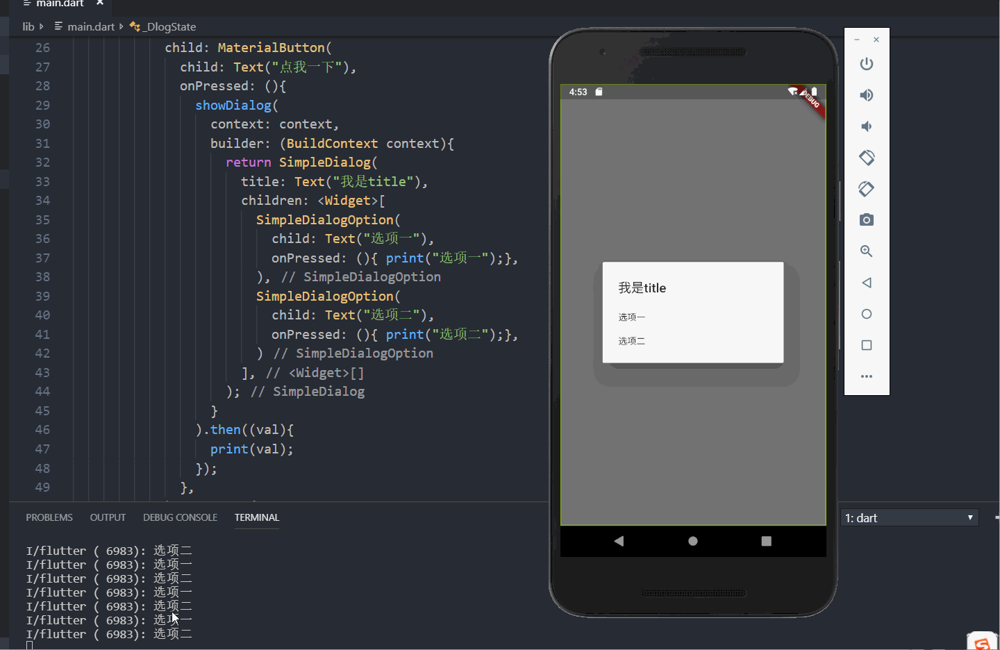
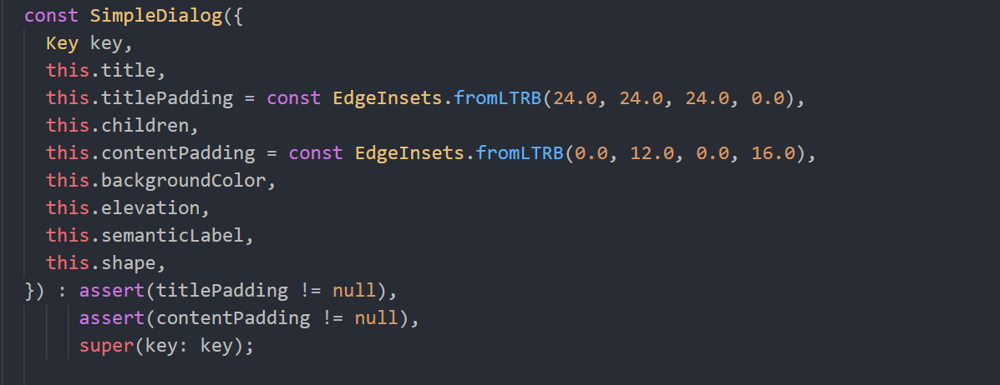
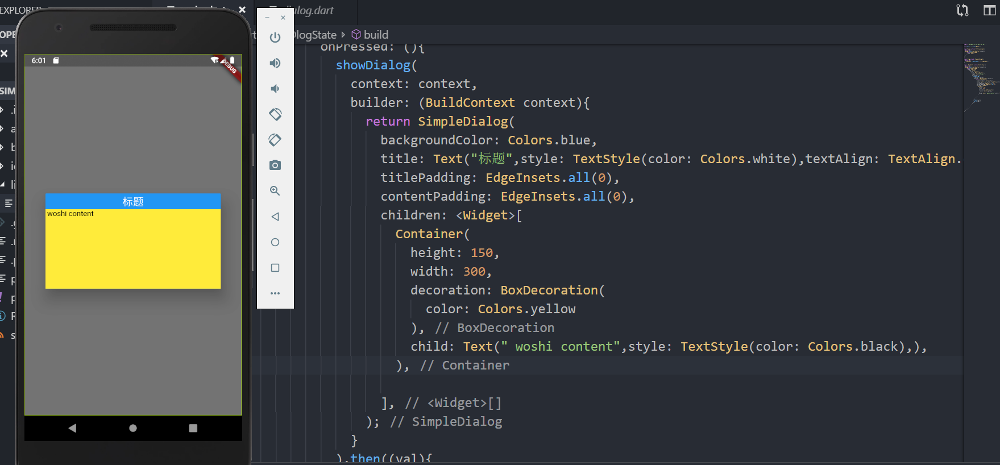
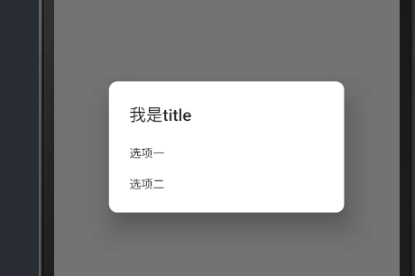

关于flutter的弹窗，有好几种,对于这些个人还是感觉很迷迷瞪瞪的，所以在这里分别写一些demo进行对比，并加以区分，只单纯作为笔记参考。

**一、SimpleDialog**
 先看一下flutter中文网对SimpleDialog的解释：
    
    
 顾名思义，这是一个简易的dialog，可能实现的功能不会太多，自己尝试着写了一个简单的demo，仅供参考。 
   
    这是个最简单的demo，就是控制台显示用户所点击的列表项，当然，你也可以在每个onPressed下面添加一个
    ~~~
        Navigator.of(context).pop();
        //用户每次点击完成之后将自动关闭弹窗
    ~~~
<!-- more -->
    官网给的也是一个类似于用户进行选择列表项的案列。
    然后去看一下SimpleDialog有哪些属性：
 
    
 * title: 这个是Dialog的顶部标题 ，title后面可以使用Text,Icon等，
 * titlePadding : 用来设置title标题的内边距。如果不设置，系统默认为上左右内边距为24pixels，一般来说如果想设置title居中，可以直接使用
    ~~~
        title:Text("我是居中的标题",style:TextStyle(textAlign:TextAlign.center))
    ~~~
 * children : 众所周知，这个应该是自定义整个Dialog的内容，就相当于提供了多个Container,自由发挥
 * contentPadding : 这个应该表示内容区域的内边距，默认提供了Top:12，Bottom：16的内边距 
 * background : 要注意，这里的背景颜色是整个Dialog的背景颜色，如果只想给标题设置单独的背景颜色，我只想到了先定义全部的背景颜色，然后子元素再去单独设置背景颜色来覆盖。  
    

 ---
 * elevation  这个是	Dialog 的悬浮高度，和阴影效果有关
 * shape   这个是Dialog的边框形状
 ~~~
 return SimpleDialog(
   shape: RoundedRectangleBorder(borderRadius: BorderRadius.all(Radius.circular(10))),
   title: Text("我是title"),
   children: <Widget>[
       SimpleDialogOption(
             child: Text("选项一"),
              onPressed: (){ print("选项一");},
        ),
       SimpleDialogOption(
              child: Text("选项二"),
               onPressed: (){ print("选项二");},
       )
    ],
  ;
 ~~~
 
