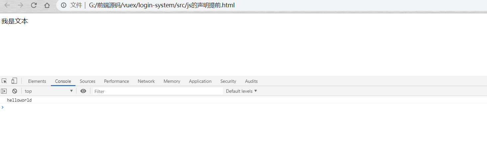

**这一篇是关于JavaScript的变量提升**

首先，Js中有一个全局对象Window,所有的表达式都在当前的环境中计算，所以全局对象的属性可以当做全局变量来用，比如
~~~
<!DOCTYPE html>
<html>
	<head>
		<meta charset="utf-8" />
		<meta name="viewport" content="width=device-width, initial-scale=1">
		<title></title>
	</head>
	<body>
		
	</body>
</html>
~~~

所以我们也可以写成
~~~
...

~~~
效果是一样的，但是有一点你要注意，这一切都是在浏览器的环境下运行的，如果你去尝试在Node的环境下去编译window.console.log("11"),他会报错的，因为在Node中，全局对象并不是Window了，而是global，除了他本身，所有的全局变量都是他的属性。
所以看下这个基本的题，
~~~
var a = 1 ;//这个时候，你定义了一个全局的变量，可以直接通过window.a来调用
console.log(a);// 1
console.log(window.a)// 1
console.log(typeof window.a);// number
console.log(typeof a);// number
~~~
了解了相关的知识后，咱们通过一个列子进入正题
~~~
var a = 3 ;

function getA(){
    console.log(a);
    var a  = 1 ;
}
getA();
~~~
聪明的你，猜一猜控制台打印的结果是什么？
打印3 是错误的，打印1 也是错误的，来分析一下这个，
首先我们定义了一个全局变量 a 初始化值为 a = 3 ; 然后程序继续执行，在进入到函数内部中，就形成了块级作用域，
即要求先打印a的值 ，于是他会优先在函数内部去寻找变量a ，如果找到 就打印 ，找不到就会去全局变量中找，如果再找不到，这个变量就是未定义的`undefined`，这个时候我们可以看到
局部变量中是有a的，所以你高高兴兴的认为 控制台会打印 1，实际上这是错误的，找到a是不假，但是由于函数的变量提升，上述代码可以写成这样
~~~
var a = 3 ;

function getA(){

    var a ;
    console.log(a);
    a  = 1 ;
}
getA();

~~~
这时候的打印结果就是 `undefined`，在js中不管是在函数内部或者全局作用域的哪个位置，当你用var 声明了一个变量，js将会优先去解析他，不管这个变量有没有初始化，
~~~
console.log(a)//undefined

var a = 4 ;
//实际上,js将这段代码解析为:
var a ;
console.log(a);
a = 4;
//这就是所谓的变量提升
~~~

再来看 ：
~~~
var b = 4;

function getB(){
    window.b =3 ;
    console.log(b)
}
getB();

~~~

这个结果你应该猜到了，没错，是3 ，首先定义了全局变量b ， 然后我们在函数内部中修改了全局变量b，打印的时候优先去函数内部寻找变量b，
window.b 在这个时候相当于重新给全局变量b赋了一个值，所以会打印出3

最后一题：
~~~
var c = 1 ;
function getC(){
    window.c = 2 ;
    console.log(c);
    var c ;
    console.log(window.c)
}
getC();
~~~
分析一下：在函数内部中，函数变量提升，我们可以写成这样:
~~~
...
    var c ;
    window.c = 2;
    console.log(c);
    console.log(window.c);

...
~~~

这样一分析，是不是就 拨开云雾见光明了 。。。 第一个优先去函数内部中找c，发现c没有定义 ，所以第一个打印`undefined`,第二个指明了去找window.c，于是第二个应该打印为 2 。

