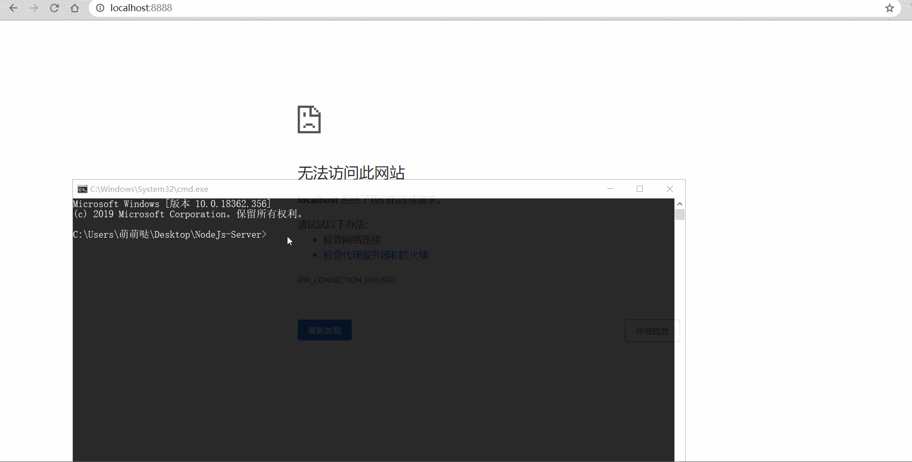

#### Node实现一个简单的服务器，并初步实现路由

首先，用Node去创建一个最简单最基本的HTTP服务器，创建一个`server.js`文件
~~~
// 引入http模块
var http = require('http');
// 调用http模块中的createServer函数，
var server = http.createServer( (request , response) =>{
    response.writeHead(200,{ 'Content-Type' : 'text/plain' });
    response.write("helloworld");
    response.end();
});
//通过createServer提供的listen方法添加监听的端口号
server.listen(8888);
//打印启动成功日志
console.log("Server Started Successfule!")

~~~
做完这些，`window`+`R`打开终端，`cd`到文件存放的根目录 ，运行 `node server.js`,打开本地端口号为[http://localhost:8888](http://localhost:8888)的地址，你会发现页面上出现 了 `helloworld`。

我们更希望将他当做一个模块化的文件去使用，并尝试去调用它里面的方法，所以将他稍微改写如下：
~~~
function startServer(){
    function onRequest(request , response){
        response.writeHead(200,{ 'Content-Type' : 'text/plain' });
        response.write("helloworld");
        response.end();
    }
http.createServer(onRequest).listen(8888);

console.log("Server Started Successfule!")

}
//这里使用CommonJs规范去导出文件
exports.startServer = startServer;
// 这样相当于 module.exports.startServer = startServer; 
~~~
接着 我们去创建一个`index.js`,内容如下：
~~~
//引入server.js
var server = require('./server');
//调用里面的startServer();
server.startServer();
~~~
命令行执行`node index.js`,浏览器打开本地服务器，和上面运行的结果是一样的。
继续往下写：
###### server.js
~~~
var url = require('url')
···
    function onRequest(request , response){
        //在这里顶一个pathname的变量，用来存放路由地址
        var pathname =  url.parse(resquest.url).pathname;
        //在这里打印一下pathname
        console.log("request for" + pathname + "received");   
        response.writeHead(200,{ 'Content-Type' : 'text/plain' });
        response.write("helloworld");
         response.end();
    }
···
~~~
###### 创建`router.js`文件
~~~
function route(pathname){
    console.log("About to route a request for " + pathname);
}
exports.route = route;
~~~
###### 将路由与服务器整合 
###### server.js
~~~
function startServer(route){
    function onRequest(request , response){
        var pathname =  url.parse(resquest.url).pathname;

        route(pathname);

        response.writeHead(200,{ 'Content-Type' : 'text/plain' });
        response.write("helloworld");
        response.end();
    }
http.createServer(onRequest).listen(8888);
console.log("Server Started Successfule!")

}
~~~
这一步将函数作为函数传递到startServer()里面去，然后调用route(pathname)
同时`index.js`改为
~~~
var server = require("./server");
var router = require("./router");

server.startServer(router.route);
~~~
这个时候再去运行一下`node index.js`,随便请求一个url,控制台就会打印一些信息
~~~
Request for /$你输入的url received.
About to route a request for /foo
~~~

###### 创建requireHandlers.js文件
~~~
function start() {
  console.log("Request handler 'start' was called.");
}

function upload() {
  console.log("Request handler 'upload' was called.");
}

exports.start = start;
exports.upload = upload;
~~~

这样我们就可以把请求处理程序和路由模块连接起来，让路由“有路可寻”。

###### 先去index.js中
~~~
var server = require("./server");
var router = require("./router");
var requestHandlers = require("./requestHandlers");

//添加url路径，存放到一个集合里面
var handle = {}
handle["/"] = requestHandlers.start;
handle["/start"] = requestHandlers.start;
handle["/upload"] = requestHandlers.upload;

server.startServer(router.route, handle);
~~~
###### server.js
~~~
····
function startServer(route, handle) {
  function onRequest(request, response) {
    var pathname = url.parse(request.url).pathname;
    console.log("Request for " + pathname + " received.");

    route(handle, pathname);

    response.writeHead(200, {"Content-Type": "text/plain"});
    response.write("Hello World");
    response.end();
  }
  http.createServer(onRequest).listen(8888);

}
····
~~~
###### router.js 文件
~~~
function route(handle, pathname) {
  console.log("About to route a request for " + pathname);
    //判断如果是一个函数类型的，就调用handle(pathname)方法
  if (typeof handle[pathname] === 'function') {
    handle[pathname]();
  } else {
    console.log("No request handler found for " + pathname);
  }
}
····
~~~
命令行运行`node index.js`，并请求http://localhost:8888/start，你会发现终端已经可以打印出一些有用的信息了
~~~
Request for /start received.
About to route a request for /start
Request handler 'start' was called.
~~~
唯一不好看的一点是，希望处理程序能够返回一些有用的信息，能让用户看到路由改变了。
###### 修改requireHandlers.js文件
~~~
function start() {
  console.log("Request handler 'start' was called.");
  return "Hello Start";
}

function upload() {
  console.log("Request handler 'upload' was called.");
  return "Hello Upload";
}

exports.start = start;
exports.upload = upload;
~~~

###### 修改router.js文件
~~~
function route(handle, pathname) {
  console.log("About to route a request for " + pathname);
  if (typeof handle[pathname] === 'function') {
    return handle[pathname]();
  } else {
    console.log("No request handler found for " + pathname);
    return "404 Not found";
  }
}

exports.route = route;
~~~

###### 在server.js文件中添加如下
~~~
 function onRequest(request, response) {
    var pathname = url.parse(request.url).pathname;
    console.log("Request for " + pathname + " received.");
    response.writeHead(200, {"Content-Type": "text/plain"});
// 用来接受函数调用的返回值，通过write方法传递给浏览器
    var content = route(handle, pathname)
    response.write(content);

    response.end();
  }

~~~

这样 就大功告成了~ 

