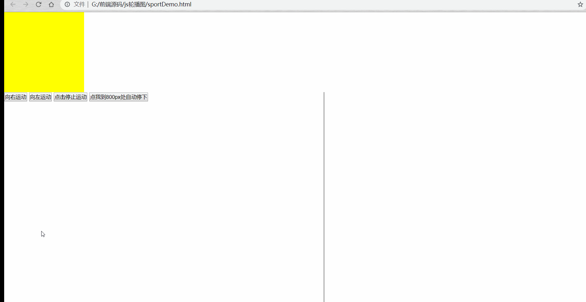

想尝试用原生js做一下轮播图的效果 ，在此之前，要先去实现一个轮播图中动画的过渡效果，实际上我们很容易的通过vue，或者jq实现一个轮播图，甚至css3也可以做到，但是本着原生大法好的原则，加深对基础js的理解及运用，话不多说 ，先看一下这个动画的Demo吧！

可能是由于录制的原因，看上去过渡效果不是太流畅，实际上是没有这些问题的。贴一下代码，顺便记录一下思路
~~~
<!DOCTYPE html>
<html>
	<head>
		<meta charset="utf-8" />
		<meta name="viewport" content="width=device-width, initial-scale=1">
		<title>定时器运动</title>
		
	</head>
	<body>
		

			
		

		

			
		

		
		<button type="button" class="btn">向右运动</button>
		<button type="button" class="btn5">向左运动</button>
		<button type="button" class="btn2">点击停止运动</button>
		<button type="button" class="btn3">点我到800px处自动停下</button>
		
	</body>
</html>
~~~

代码中没有什么特别需要注意的地方，基本上的逻辑就是 在运动前开启定时器，并通过`getComputedStyle()`属性去获取当前盒子移动的距离，left,这个属性获取到的是一个带px的字符串，所以咱们通过parseInt去转换为数字，通过该数字加或者减去每毫秒运动的直线距离，绑定按钮点击事件，从而达到使得盒子运动的过渡动画效果
Tip:在点击按钮事件是，我们第一件事是要去关闭上一次的定时器，如果不关闭，会出现 ：一直点击向左的按钮，那么这个盒子运动的速度会越来越快，关闭之后，再怎么点击，都不会出现盒子加速的后果。
